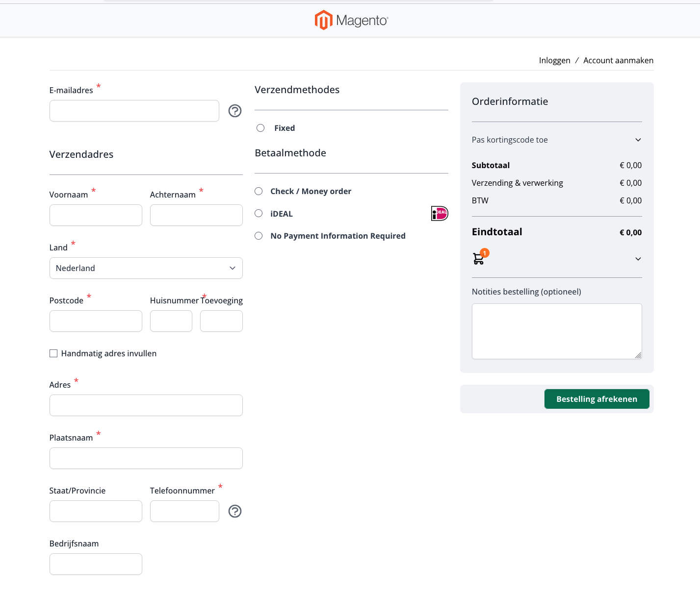

# Omnikassa / Rabo Smart Pay payments for [Hyvä checkout](https://www.hyva.io/hyva-checkout.html)
This [Mage-OS](https://mage-os.org/) extension is a Hyvä checkout compatiblity extension for [Codebrainbv_Omnikassapayment](https://commercemarketplace.adobe.com/codebrainbv-omnikassapayment.html).

## Installation
```bash
composer require vendic/hyva-checkout-omnikassa-payment
```

### Features
- Redirect to the correct Omnikassa payment url after placing an order
- Add payment method logo's in the checkout

### Screenshot

